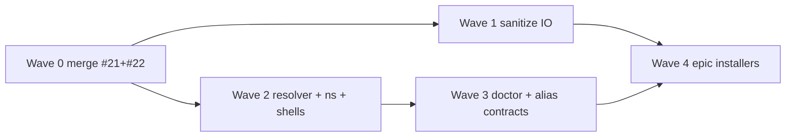

# CLI implementation scaffold — rehydrated plan & execution

Single source of truth for **what to build**, **in what order**, and **how parallel agents execute** without stepping on each other.

**Stack:** bash engine (shellcheck/shfmt) · bash/zsh/fish adapters · PowerShell deferred.

Related: [tasks.md](../tasks.md) · [TDD_ORCHESTRATION.md](TDD_ORCHESTRATION.md) · [SWARM_ORCHESTRATION.md](SWARM_ORCHESTRATION.md)

---

## 1. Architecture (hydrated)

```text
┌─────────────────────────────────────────────────────────────┐
│  Interactive shells                                         │
│  bash/zsh → portable-dev-env/shell/aliases.sh + ns-env.sh   │
│  fish     → portable-dev-env/shell/aliases.fish (no bash)   │
└───────────────────────────┬─────────────────────────────────┘
                            │ bash "$NS_SCRIPTS/…"
                            ▼
┌─────────────────────────────────────────────────────────────┐
│  CLI entry: scripts/ns  →  check | setup | doctor | help    │
└───────────────────────────┬─────────────────────────────────┘
                            │
        ┌───────────────────┼───────────────────┐
        ▼                   ▼                   ▼
 health-check-core   neuro-spicy-setup    doctor-core
        │                   │                   │
        └───────────────────┴───────────────────┘
                            │
                    scripts/lib/ns-*.sh
                    exit 0/1/2/3 · flags · profile · resolver
```

| Path | Role | Status |
|------|------|--------|
| `scripts/lib/ns-exit-codes.sh` | Exit contract | **Done** |
| `scripts/lib/ns-version.sh` | Semver for profiles | **Done** |
| `scripts/lib/ns-cli.sh` | `--verbose` `--quiet` `--non-interactive` `--dry-run` | **Done** |
| `scripts/lib/ns-profile.sh` | Read `requirements` from profile JSON | **Done** |
| `scripts/lib/ns-root.sh` | Repo root resolution | **Scaffold** |
| `scripts/lib/ns-resolver.sh` | detect → plan → apply (`--dry-run`; real install blocked) | **Scaffold** |
| `scripts/ns` | Unified dispatcher | **Scaffold** |
| `scripts/doctor-core.sh` | Deep diagnostic wrapper | **Scaffold** |
| `portable-dev-env/shell/ns-env.sh` | `NS_DEVKIT_ROOT` / `NS_SCRIPTS` | **Scaffold** |
| `portable-dev-env/shell/aliases.sh` | bash/zsh functions → engine | **Wired** |
| `portable-dev-env/shell/aliases.fish` | fish functions → engine | **Scaffold** |

---

## 2. MVP user story (unchanged)

**As a** developer on bash, zsh, or fish,  
**I want** `check` → `setup` → `doctor` with predictable flags and exit codes,  
**So that** agents and CI automate bring-up without parsing prose logs.

### Commands

| User types | Engine invoked |
|------------|----------------|
| `ns check` / `check` | `health-check-core.sh` |
| `ns setup` / `setup` | `neuro-spicy-setup-core.sh` |
| `ns doctor` / `doctor` | `doctor-core.sh` |
| `ns setup --dry-run` | setup dry-run |
| `./tests/run.sh` | TDD gate |

---

## 3. TDD phases — execution checklist

Use **red → green → refactor** per [TDD_ORCHESTRATION.md](TDD_ORCHESTRATION.md).

| Phase | Owner lane | Test file | Implement until green |
|-------|------------|-----------|------------------------|
| 0–2 | (merged on #22) | `test_ns_*.sh`, `test_health_exit.sh` | Libs + health exits |
| **3** | W2-A | `tests/unit/test_ns_resolver.sh` | Harden `ns-resolver.sh`; profile `--profile` on setup |
| **3b** | W2-B | `tests/unit/test_ns_entry.sh` | `scripts/ns` flag forwarding matrix |
| **4** | W2-C / W2-D | `tests/integration/test_shell_adapters.sh` | Completions; fish parity |
| **4b** | W3-B | `tests/integration/test_cli_aliases.sh` | All epic aliases |
| **5** | W1-A | issue #8/#12 tests | No `curl\|bash`; then enable resolver install |
| **6** | deferred | Pester later | `*.ps1` |

**Gate:** Phase 5 green before `NS_RESOLVER_DRY_RUN=false` in production paths.

---

## 4. Swarm waves (parallel execution)

See [SWARM_ORCHESTRATION.md](SWARM_ORCHESTRATION.md). Lane briefs: [docs/scaffold/lanes/](scaffold/lanes/).



| Wave | Parallel agents | Disjoint ownership |
|------|-----------------|------------------|
| 0 | 1× merge captain | CI only |
| 1 | W1-A ∥ W1-C (∥ W1-B PS1 optional) | init.sh vs docker vs ps1 |
| 2 | W2-A ∥ W2-B ∥ W2-C ∥ W2-D | resolver vs `ns` vs aliases.sh vs aliases.fish |
| 3 | W3-A ∥ W3-B | doctor-core vs integration alias tests |
| 4 | W4-A…D per language/MCP | one column per agent |

---

## 5. Agent hydration pack (copy into every session)

```text
Repo:     k-dot-greyz/neuro-spicy-devkit
Base:     origin/greyzxcursor/cli-shell-orchestration-b042 (or main after merge train)
Branch:   greyzxcursor/<lane>-b042
Read:     docs/CLI_IMPLEMENTATION_SCAFFOLD.md + docs/scaffold/lanes/<LANE>.md
Iron law: failing test first; smallest green diff
Verify:
  ./tests/run.sh
  shellcheck scripts/*.sh scripts/lib/*.sh portable-dev-env/shell/*.sh
  fish -n portable-dev-env/shell/aliases.fish   # if fish installed
Out of scope:
  curl|bash installers
  NS_RESOLVER_DRY_RUN=false before issue #8
  second test harness (no Bats)
PR:       draft, one lane, link Epic #20 + issue IDs
```

---

## 6. Local verification matrix

```bash
# TDD gate (required)
./tests/run.sh

# CLI smoke
bash scripts/ns help
bash scripts/ns doctor --dry-run
bash scripts/health-check-core.sh --help

# Resolver dry-run (library)
source scripts/lib/ns-resolver.sh
NS_RESOLVER_DRY_RUN=true ns_resolver_apply portable-dev-env/profiles/templates/frontend-developer.json

# Shell adapters
source portable-dev-env/shell/aliases.sh && type check && type doctor

# Static analysis
shellcheck scripts/ns scripts/doctor-core.sh scripts/lib/*.sh
shfmt -d -i 4 -ci scripts/*.sh scripts/lib/*.sh
```

---

## 7. Next implementation slices (ordered)

1. **W2-B:** Wire `neuro-spicy-setup-core.sh` to `ns_cli_parse` + `--profile` + call `ns_resolver_apply` on dry-run.
2. **W2-A:** Expand resolver tool matrix (rust/python/node); version checks via `ns-version.sh`.
3. **W3-A:** `doctor-core` connectivity section (offline mock + optional network job in integration).
4. **W1-A:** Replace OpenClaw `curl|bash` — then flip install branch in `ns_resolver_apply`.
5. **W4-*:** Epic columns — planner only until 4 is done.

---

## 8. File tree (scaffold additions)

```text
scripts/
  ns                          # CLI dispatcher
  doctor-core.sh              # doctor command
  lib/
    ns-root.sh
    ns-resolver.sh
portable-dev-env/shell/
  ns-env.sh
  aliases.sh                  # sources ns-env; check/setup/doctor functions
  aliases.fish
  README.md
tests/
  unit/test_ns_resolver.sh
  unit/test_ns_entry.sh
  integration/test_shell_adapters.sh
  integration/test_cli_aliases.sh
docs/
  CLI_IMPLEMENTATION_SCAFFOLD.md   # this file
  scaffold/lanes/W2-A-resolver.md
  scaffold/lanes/W2-B-ns-entry.md
  scaffold/lanes/W2-C-bash-zsh.md
  scaffold/lanes/W2-D-fish.md
  scaffold/lanes/W1-A-sanitize-bash.md
```

---

## 9. Definition of done (CLI MVP)

- [ ] `./tests/run.sh` green on CI
- [ ] `ns check|setup|doctor|help` documented in README/AGENTS
- [ ] bash + zsh source `aliases.sh` without error; `fish -n aliases.fish` clean
- [ ] Resolver never installs with `NS_RESOLVER_DRY_RUN=false` until #8 closed
- [ ] No PAT in profile JSON (bash creds path only) — Wave 1

When all checked, Epic #20 language/MCP installer columns may proceed on Wave 4.
