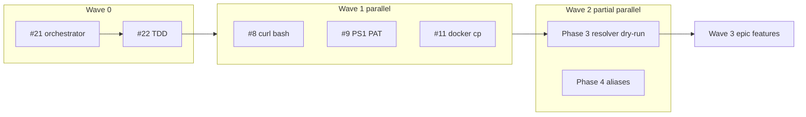

# Labels, linking, and PR upkeep

Codified procedure for **issues**, **pull requests**, and **parallel agent sessions** on the Neuro-Spicy DevKit merge train (#21 → #22 → sanitize → epic #20).

**Canonical label list:** [.github/labels.yml](../.github/labels.yml) (synced to GitHub when that file changes on `main`).

---

## North star: one merge train

| Order | Artifact | Typical branch | Rule |
|-------|----------|----------------|------|
| 1 | Orchestrator MVP | `greyzxcursor/fullstack-orchestrator-91b7` (#21) | Do not merge #5 separately — mark **superseded** |
| 2 | TDD gate + libs | `greyzxcursor/tdd-orchestration-431f` (#22) | Stack on #21 until #21 lands |
| 3 | Security / IO sanitize | `greyzxcursor/<issue>-<short>-2a19` | Block real installs until green |
| 4 | Epic #20 features | Same train, slices from `tasks.md` | Install only via hardened resolver |

**Hydration rule:** Every session uses the **same base ref** (agreed at kickoff) and ends with `./tests/run.sh` (+ targeted integration) and **one narrow PR**.

---

## Label taxonomy

Labels are **orthogonal dimensions**. Apply every label that applies (usually 3–6 per issue/PR).

### Dimension A — Type (what is it?)

| Label | Use when |
|-------|----------|
| `epic` | Multi-PR outcome; tracks checklist in body |
| `task` | Single deliverable, usually one PR |
| `bug` | Regression or broken behavior |
| `enhancement` | New capability |
| `documentation` | Docs-only |
| `ci` | Workflows, hooks, test harness |
| `chore` | Repo hygiene, labels, templates |
| `security` | Credentials, unsafe IO, supply chain |
| `audit` | Tracker / compliance doc, no product code |

### Dimension B — Gate / wave (when in the train?)

| Label | Use when |
|-------|----------|
| `wave-0-merge` | Foundation merge only (CI green, no new features) |
| `wave-1-sanitize-io` | Issues #8–#12, #17 — unsafe IO, PAT, docker |
| `wave-2-resolver` | `ns-resolver`, aliases, profile `--dry-run` |
| `wave-3-epic` | Rust/Python/Node installers, MCP fleet, wizards |

### Dimension C — Lane (who owns files?)

Disjoint ownership for parallel agents.

| Label | Typical paths |
|-------|----------------|
| `lane-bash` | `*.sh`, `init.sh`, bash OpenClaw paths |
| `lane-powershell` | `*.ps1`, `init.ps1`, profile JSON writes |
| `lane-docker` | `portable-dev-env/openclaw/docker/**` |
| `lane-tdd` | `tests/**`, `scripts/lib/ns-*.sh` |

### Dimension D — Area (subsystem)

| Label | Scope |
|-------|--------|
| `area-bash` | Bash scripts and libs |
| `area-powershell` | PowerShell scripts |
| `area-docker` | Containers / compose |
| `area-ci` | `.github/**`, pre-commit |
| `area-profiles` | `portable-dev-env/profiles/**` |
| `area-mcp` | MCP config and packages |

### Dimension D — TDD phase (optional, from `tasks.md`)

| Label | Phase focus |
|-------|-------------|
| `tdd-phase-0` | Harness / CI |
| `tdd-phase-1` | Exit codes, semver, CLI flags |
| `tdd-phase-2` | Profile + health wiring |
| `tdd-phase-3` | Resolver `--dry-run` |
| `tdd-phase-4` | Aliases + MCP integration |
| `tdd-phase-5` | PS1 / Pester parity |

### Dimension E — Train status (maintenance)

| Label | Use when |
|-------|----------|
| `merge-train` | Part of active stacked merge sequence |
| `safe-to-stack` | Reviewed; expected to rebase cleanly on train head |
| `blocked` | Waiting on another issue/PR (name blocker in body) |
| `superseded` | Do not merge; link to replacement PR |

### Dimension F — Risk (sanitize first)

| Label | Use when |
|-------|----------|
| `unsafe-io` | `curl \| bash`, unverified remote install |
| `credentials` | Tokens, PAT, `~/.config/neuro-spicy/` |

### Community (GitHub defaults)

Keep using `good first issue`, `help wanted`, `question`, `duplicate`, `invalid`, `wontfix` as usual.

---

## Linking procedure

### Issue creation

1. Pick template: **Epic**, **Task**, or **Security / IO**.
2. Title prefix:
   - `[Epic]` — program slice
   - `[Task]` — single PR scope
   - `[Security]` — sanitize lane
3. Body **must** include a **Links** section:

```markdown
## Links
- Parent epic: #20
- Depends on: #8 (or none)
- Blocks: #22 slice 3
- Related PRs: #21, #22
- Supersedes: #5 (if applicable)
```

4. Apply labels: **type** + **wave** + **lane** + **area** (+ **risk** if needed).

### Pull request creation

1. Branch: `greyzxcursor/<issue-or-topic>-<short>-2a19` (cloud agents) or agreed swarm suffix.
2. Title prefix: same as issue (`[TDD]`, `[Security]`, `[Epic]`, etc.).
3. Base branch:
   - Stacked work → base = **current train head** (e.g. `greyzxcursor/tdd-orchestration-431f`), not `main`, until foundation is merged.
   - Post-merge slices → base = `main`.
4. Body **must** include (PR template enforces):

```markdown
## Tracks
- Closes #N (or "Part of #20 — no close until epic done")

## Merge train
- Base: greyzxcursor/tdd-orchestration-431f
- Label: merge-train, safe-to-stack

## Links
- Depends on PR: #22
- Supersedes PR: #5 — close when this merges
- Blocks: resolver real installs until merged

## Definition of done
- [ ] Failing test first (if behavior change)
- [ ] `./tests/run.sh`
- [ ] `shellcheck` on touched `*.sh`
- [ ] `--dry-run` path unchanged or extended
```

5. GitHub keywords:
   - `Closes #N` / `Fixes #N` — auto-close on merge (one issue per PR when possible).
   - Do **not** `Closes #20` until the epic is actually done; use **Tracks #20**.

### Closing / superseding PRs

When PR B replaces PR A:

1. Label A with `superseded`.
2. Comment on A: `Superseded by #B — close without merge.`
3. On B body: `Supersedes PR #A`.
4. Close A as **not planned** or **closed** without merge (do not merge both).

### Parallel agent hydration pack

Paste at session start:

```text
Repo: k-dot-greyz/neuro-spicy-devkit
Base branch: <train-head>  # e.g. greyzxcursor/tdd-orchestration-431f
Branch: greyzxcursor/<issue>-<short>-2a19
Iron law: failing test first (tests/unit or tests/integration)
Run: ./tests/run.sh && shellcheck on touched files
Do NOT: ns-resolver real installs, new MCP packages, Rustup automation
Labels: <type>, <wave>, <lane>, <area>
Links: Depends on #N; Tracks #20
PR: draft, narrow title, merge-train checklist
```

---

## Dependency graph (parallel vs serial)



**Parallel-safe after Wave 0:** lanes A/B/C (bash / PS1 / docker) with disjoint files.  
**Serial:** real `install` in resolver → after #8 + credential parity; epic mass install → after Phase 3 dry-run green.

---

## PR maintenance cadence

| Cadence | Action |
|---------|--------|
| Each push | CI + `./tests/run.sh` on PR branch |
| Weekly (train active) | Rebase open `merge-train` PRs onto train head |
| On merge | Remove `merge-train` from merged; update blocked issues |
| Stale > 14d | Comment: rebase or close; label `superseded` if replaced |
| After Wave 0 | Retarget stacked PRs to `main` |

---

## Suggested improvements (not yet automated)

1. **Milestones** — `Wave 0 Foundation`, `Wave 1 Sanitize`, `Wave 2 Resolver`, `Wave 3 Epic` — group issues for board views.
2. **Required linked issue** — branch protection: PR must reference an issue (`Tracks` or `Closes`) except `chore`/`documentation` with `ci` only.
3. **Draft until DoD** — keep agent PRs draft until checklist complete; human flips to ready.
4. **Stack comment bot** — optional Action: comment base branch + diff behind `main` count on open PRs.
5. **Label hygiene** — merge train closed → strip `merge-train` from linked issues; run label sync after editing [.github/labels.yml](../.github/labels.yml).
6. **Issue parent field** — GitHub sub-issues (when enabled) for #20 children; until then, epic body lists children explicitly.
7. **AUDIT cross-link** — security tasks link row in `AUDIT_IMPLEMENTATION.md` when that doc is on branch.
8. **No double CI** — one PR per slice; avoid two PRs touching `health-check-core.sh` + `health-check-core.ps1` in the same wave without coordination.

---

## Quick reference — issue ↔ label

| Issue | Suggested labels |
|-------|------------------|
| #8 OpenClaw curl bash | `security`, `unsafe-io`, `wave-1-sanitize-io`, `lane-bash`, `area-bash`, `task` |
| #9 PS1 PAT in JSON | `security`, `credentials`, `wave-1-sanitize-io`, `lane-powershell`, `area-profiles`, `task` |
| #10 PS1 token escaping | `security`, `wave-1-sanitize-io`, `lane-powershell`, `area-powershell`, `task` |
| #11 Docker cp | `bug`, `wave-1-sanitize-io`, `lane-docker`, `area-docker`, `task` |
| #12 OpenClaw health `set -e` | `security`, `wave-1-sanitize-io`, `lane-bash`, `area-bash`, `task` |
| #17 SEC-001 keychain / no PAT in JSON | `security`, `credentials`, `wave-1-sanitize-io`, `lane-bash`, `lane-powershell`, `area-profiles`, `task` |
| #20 Epic orchestrator | `epic`, `wave-3-epic`, `merge-train` |
| TDD libs | `task`, `wave-2-resolver`, `lane-tdd`, `tdd-phase-1` … `tdd-phase-5` |

Pre-filled Wave 1 bodies + apply script: [WAVE_1_SANITIZE.md](WAVE_1_SANITIZE.md) · [github-issues/wave-1/](github-issues/wave-1/README.md)

See also [tasks.md](../tasks.md), [TDD_ORCHESTRATION.md](TDD_ORCHESTRATION.md), [AGENTS.md](../AGENTS.md).
