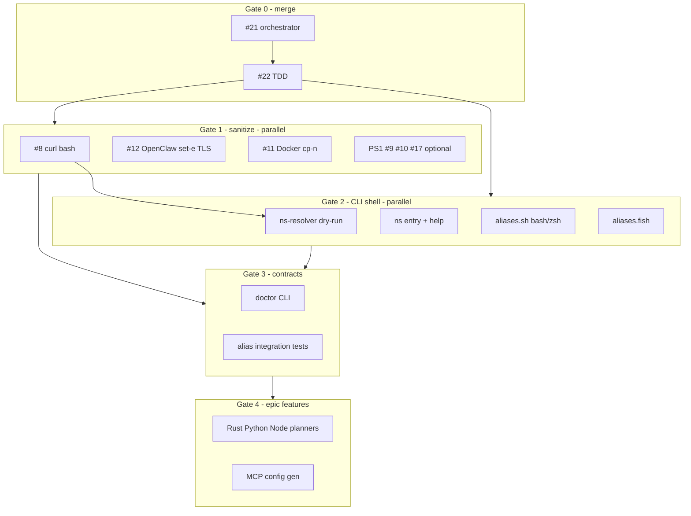

# Swarm orchestration — CLI-first (bash / zsh / fish)

How to run focused parallel agent sessions for Epic #20 **without** double-work or stacking installs on unsafe IO.

Companion docs: [tasks.md](../tasks.md), [TDD_ORCHESTRATION.md](TDD_ORCHESTRATION.md).

## North star

| Order | Artifact | Branch / PR | Rule |
|-------|----------|-------------|------|
| 1 | Orchestrator MVP | #21 `greyzxcursor/fullstack-orchestrator-91b7` | Close #5 as superseded; do not merge #5 then #21 |
| 2 | TDD gate | #22 `greyzxcursor/tdd-orchestration-431f` | Stack on #21 |
| 3 | CLI shell plan (this doc) | branch off #22 | Docs + next CLI slices |
| 4 | Sanitize bash/IO | issue branches | **Blocks** real resolver installs |
| 5 | CLI adapters + entry | bash/zsh/fish | Parallel OK with dry-run resolver |
| 6 | Epic installers / MCP | profile columns | After sanitize + dry-run green |

**Hydration rule:** Every swarm agent starts from the **same agreed base ref**, owns a **disjoint file set**, ends with `./tests/run.sh` (+ shellcheck / `fish -n` as applicable), and opens **one draft PR**.

## Product priority (what “done” means this train)

1. **CLI engine in bash** — predictable flags + exit codes (`check` / `setup` / `doctor`).
2. **Interactive parity: bash + zsh + fish** — adapters invoke the engine; fish does not source bash.
3. **Sanitize unsafe bash IO** before non-dry-run installs.
4. **PowerShell** — security fixes if urgent (#9/#10/#17), else Phase 6 after shell triad.

## Dependency graph



## Wave 0 — Merge captain (solo)

- Land #21 then #22 (or squash stack).
- Close #5 → superseded by #21.
- **Out of scope:** new features, new shells.

## Wave 1 — Sanitize IO

| Agent | Issues | Owns | Parallel |
|-------|--------|------|----------|
| **W1-A** | #8, #12 | bash init / OpenClaw install+health | ∥ W1-C |
| **W1-C** | #11 | Docker OpenClaw copy path | ∥ W1-A |
| **W1-B** | #9, #10, #17 | `*.ps1` token/profile (optional this wave) | ∥ if no bash file overlap |

**DoD:** no `curl|bash`; tests or documented checksum/vendored install; `./tests/run.sh` green.

## Wave 2 — CLI shell triad (primary parallel swarm)

| Agent | Scope | Owns | Tests |
|-------|--------|------|-------|
| **W2-A** | Resolver dry-run | `scripts/lib/ns-resolver.sh` | `tests/unit/test_ns_resolver.sh` |
| **W2-B** | CLI entry / help | `scripts/ns` (or `bin/ns`), wire `ns_cli_parse` | `tests/unit/test_ns_entry.sh` |
| **W2-C** | bash + zsh adapters | `portable-dev-env/shell/aliases.sh`, optional `completions.bash` / `.zsh` | source smoke under bash and zsh |
| **W2-D** | fish adapter | `portable-dev-env/shell/aliases.fish` | `fish -n`; invoke bash engine only |

**Shared out of scope for Wave 2:** real network installs, MCP package installs, Rustup automation, PowerShell rewrites.

**Merge tip:** W2-C and W2-D touch different files → true parallel. W2-A / W2-B may both touch setup — serialize if fighting `neuro-spicy-setup-core.sh`.

## Wave 3 — Doctor + alias contracts

| Agent | Scope |
|-------|--------|
| **W3-A** | `doctor` command (bash engine) + exit-code integration |
| **W3-B** | `tests/integration/test_cli_aliases.sh` — `check`/`setup`/`doctor`/`push` resolve correctly when adapters loaded |

## Wave 4 — Epic feature columns (after Wave 1 + W2-A)

One language/profile column per agent (Rust / Python / Node / MCP **config gen only**). Planner stubs via resolver; no global installs in CI.

## Agent hydration pack (paste into every run)

```text
Repo: k-dot-greyz/neuro-spicy-devkit
Base: origin/greyzxcursor/tdd-orchestration-431f  (or main after Wave 0 merge)
Branch: greyzxcursor/<lane-short-name>-b042
Product: CLI-first — bash engine; bash/zsh/fish adapters; PS1 deferred unless security lane
Iron law: failing test first (tests/unit or tests/integration)
Accept:
  ./tests/run.sh
  shellcheck on touched bash
  fish -n on touched fish (if fish available)
Do NOT:
  curl|bash installers
  real resolver installs before #8 green
  parallel edits to files owned by another open PR
  invent a second test harness
Handoff: checkbox in tasks.md + PR links issue / epic #20
```

## Double-work kill list

1. Do not patch `main` for token/CI/push-retry already on #21/#22.
2. Do not add Bats/Pester as a second primary harness for bash CLI — extend `./tests/run.sh`.
3. Do not treat fish as “source the bash aliases” — separate adapter.
4. Do not run Epic #20 language installers before sanitize Wave 1.
5. Do not let PS1 parity block bash/zsh/fish CLI MVP.

## Suggested immediate roster

| Priority | Mission | Parallel? |
|----------|---------|-----------|
| P0 | Wave 0 merge captain | Solo |
| P1 | W1-A #8+#12 ∥ W1-C #11 | Yes |
| P1 | W2-C bash/zsh aliases + W2-D fish | Yes (after or with docs merge) |
| P2 | W2-A resolver dry-run ∥ W2-B `ns` entry | Yes with file boundaries |
| P3 | W3 alias contracts + doctor | After Wave 2 |
