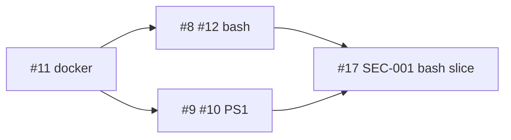

# Wave 1 — sanitize IO (swarm brief)

Parallel agents after **Wave 0** (#21 + #22 on `main`). **Do not** run resolver network installs until this wave is merged.

Full issue bodies: [github-issues/wave-1/](github-issues/wave-1/README.md)

## Lanes (disjoint ownership)



| Agent | Issues | Owns |
|-------|--------|------|
| **W1-C** | #11 | `portable-dev-env/openclaw/docker/**` |
| **W1-A** | #8, #12 | `scripts/neuro-spicy-init.sh`, `scripts/health-check-core.sh` (bash OpenClaw + curl) |
| **W1-B** | #9, #10 | `scripts/neuro-spicy-init.ps1`, `scripts/setup-github-token.ps1` |
| **W1-D** | #17 | Bash credential migration (split PS1 with #9) |

## Merge order

1. **#11** (docker) — smallest blast radius  
2. **#8** then **#12** (same lane — one agent or sequential PRs)  
3. **#9** then **#10** (PS1)  
4. **#17** (may be 2 PRs: bash + doc)

## Shared DoD (every Wave 1 PR)

- Failing test first when behavior changes
- `./tests/run.sh`
- `shellcheck` on touched `*.sh`
- `--dry-run` preserved or extended
- PR template: `Closes #N`, base = train head or `main`, labels from manifest

## Hydration pack (copy per agent)

```text
Repo: k-dot-greyz/neuro-spicy-devkit
Wave: wave-1-sanitize-io
Base: main (post Wave 0) or greyzxcursor/tdd-orchestration-431f
Branch: greyzxcursor/<issue>-<short>-2a19
Body template: docs/github-issues/wave-1/issue-<N>.md
Manifest labels: docs/github-issues/wave-1/manifest.yml
Iron law: failing test first
Run: ./tests/run.sh
Do NOT: ns-resolver real installs, MCP fleet, rustup automation
```

## Apply GitHub metadata (maintainer)

Cloud agents cannot label/edit issues (token scope). Run locally:

```bash
./scripts/github-apply-issue-metadata.sh --sync-labels
./scripts/github-apply-issue-metadata.sh --manifest docs/github-issues/wave-1/manifest.yml
```

Optional: paste [epic-20-wave-1-comment.md](github-issues/wave-1/epic-20-wave-1-comment.md) on #20.

See [LABELS_AND_LINKING.md](LABELS_AND_LINKING.md).
